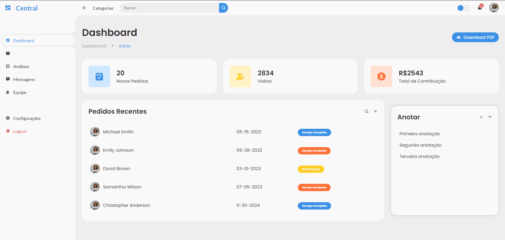

# AdminHub Dashboard

Welcome to the AdminHub Dashboard repository!

AdminHub Dashboard is a sleek and modern dashboard design created using HTML, CSS, and JavaScript. This repository contains the source code for the AdminHub Dashboard.

## Features

- Responsive layout for desktop and mobile devices
- Elegant design with intuitive navigation
- Charts and graphs for data visualization
- Customizable and easy to integrate into web applications

## Preview

## Getting Started

To get started with AdminHub Dashboard, follow these steps:

1. Clone this repository: `https://github.com/Vinishireis/DashBoard_Responsive.git`
2. Open the `index.html` file in your web browser to view the dashboard.

## Technologies Used

- HTML
- CSS
- JavaScript

## Contributing

Contributions are welcome! If you have any suggestions, improvements, or bug fixes, feel free to open an issue or submit a pull request.

